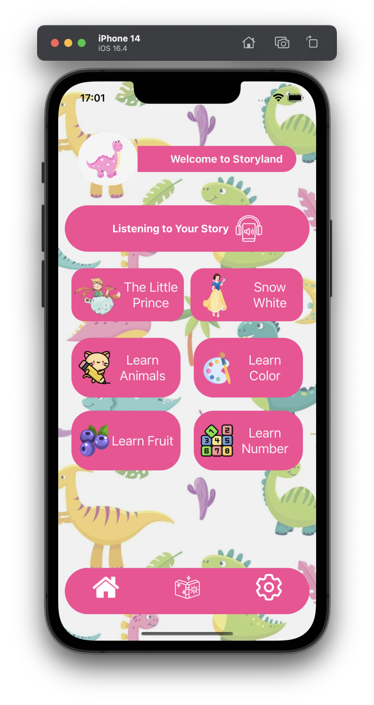
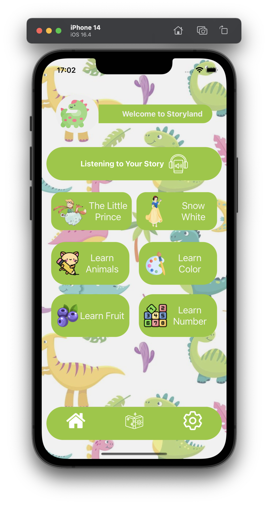
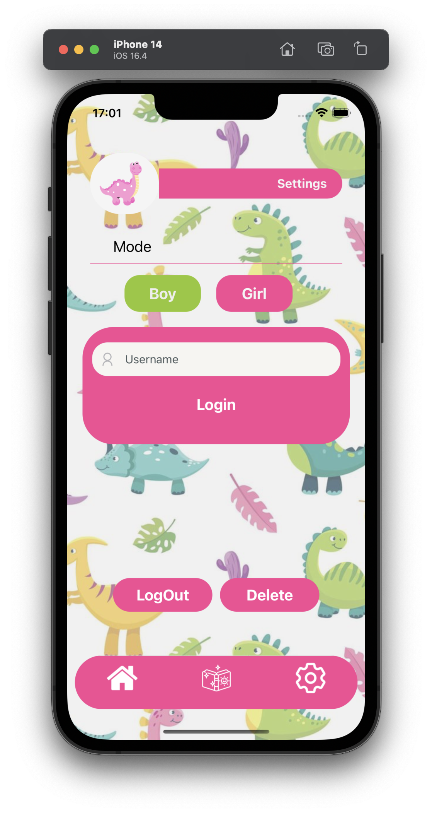
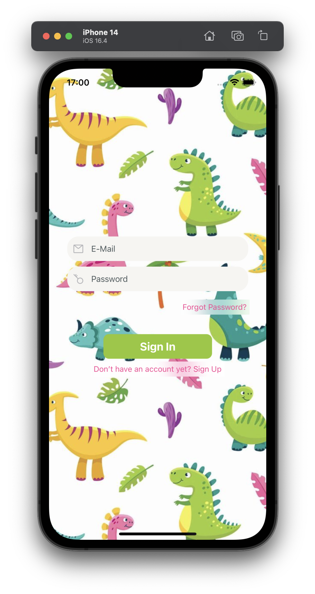
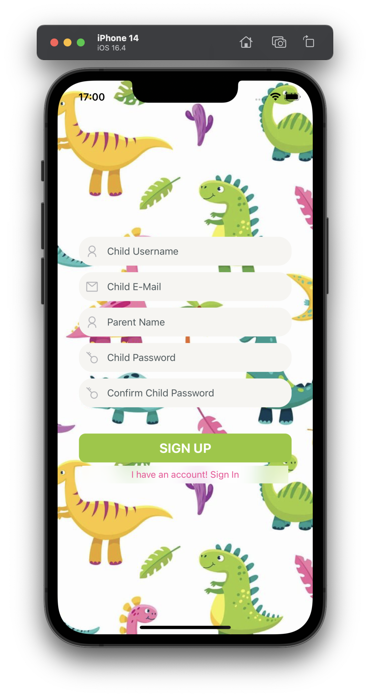
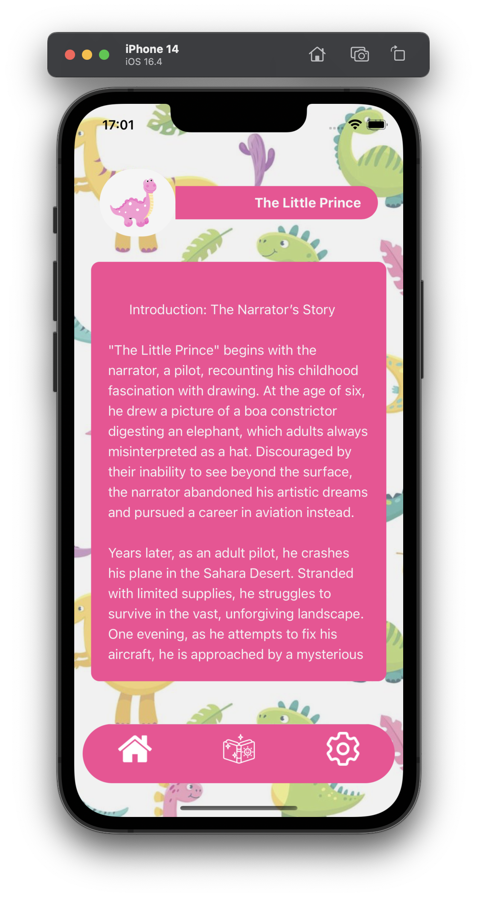
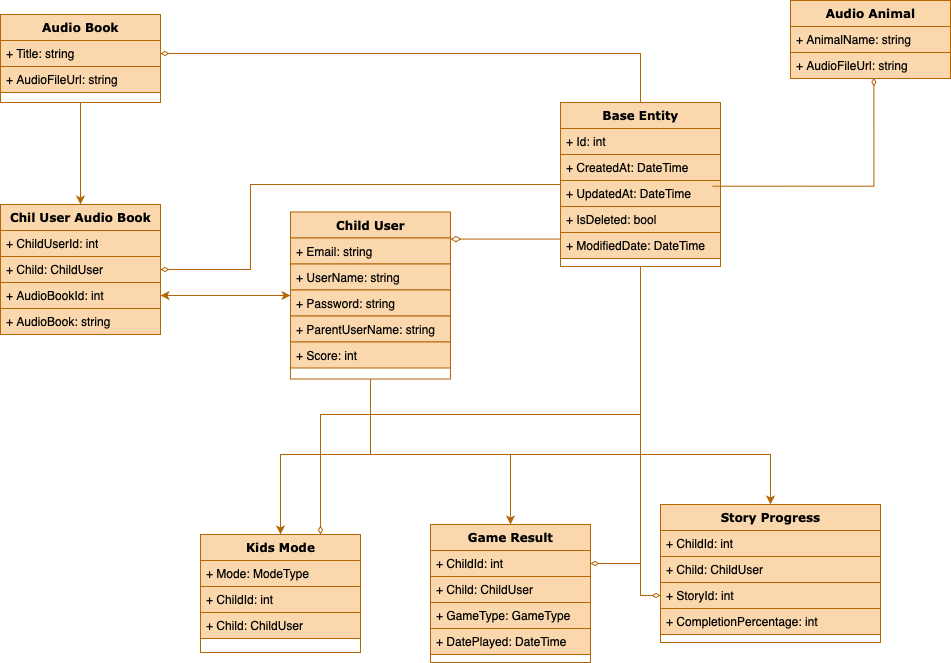

# 📚 **Mini Keşif APP**

### **Etkileşimli Çocuk Eğitim Uygulaması**

 |  | 
:---:|:---:|:---:
**Ana Sayfa** | **Çocuk Modu** | **Ayarlar**

 |  | 
:---:|:---:|:---:
**Giriş Sayfası** | **Kayıt Sayfası** | **Hikaye Sayfası**

---
## 🚀 **Proje Özeti**

**Mini Keşif APP**, çocukların eğlenerek öğrenmesini sağlayan interaktif bir mobil uygulamadır. Renk eşleştirme, sayı sayma gibi eğitici mini oyunlar ve sesli kitaplar içermektedir. Ayrıca, ebeveynler çocuklarının ilerlemelerini bir ebeveyn paneli üzerinden takip edebilir.

**🛠️ Teknolojiler:**

- **Back-End:** ASP.NET Core Web API
- **Front-End:** React Native (Expo)
- **Veritabanı:** Entity Framework Core (PostgreSQL)
- **Authentication:** JWT (JSON Web Tokens)

### 🎨 **Figma Tasarımı:**

[**Interactive Kids App Tasarımı**](https://www.figma.com/design/SMt8G71X1Dm0QSYUWQnHw4/InteractiveKidsApp?node-id=13-50&t=pb76WNTbYMnikEwH-1)

---
## 📂 **Proje Yapısı**

### **1. Back-End (ASP.NET Core Web API)**

**Klasör Yapısı:**


**Temel Özellikler:**

- **JWT Tabanlı Kimlik Doğrulama:** Kullanıcıların güvenli bir şekilde oturum açmasını sağlar.
- **API Endpoint'leri:**
  - `/api/auth/registerChild` → Çocuk kullanıcı kaydı.
  - `/api/auth/login` → JWT ile çocuk kullanıcı girişi.
  - `/api/auth/parentLogin` → Ebeveyn kullanıcı girişi.
  - `/api/auth/logout` → Kullanıcı çıkışı.
  - `/api/user` → Kullanıcı işlemleri (CRUD).
  - `/api/games/saveResult` → Oyun sonucu kaydı.
  - `/api/games/getResults` → Oyun sonuçlarını listeleme.
  - `/api/audiobooks/list` → Sesli kitapları listeleme.
  - `/api/audiobooks/get/{id}` → Kitap detayları.
  - `/api/audioanimal` → Hayvan sesleri ekleme.
  - `/api/kidsmode` → Çocuk modlarını yönetme.
  - `/api/parent/getProgress/{childId}` → İlerleme bilgileri.

**Veritabanı Modelleri:**

- **ChildUser:** Çocuk kullanıcı bilgileri.
- **GameResult:** Oyun sonuçları.
- **StoryProgress:** Hikaye ilerlemeleri.
- **AudioBook:** Sesli kitap bilgileri.
- **AudioAnimal:** Hayvan sesleri.
- **KidsMode:** Çocuk modları (Erkek/Kız).
- **ChildUserAudioBook:** Çocuk ve sesli kitap ilişkisi (Çoka Çok İlişki).

### **2. Front-End (React Native + Expo)**

**Özellikler:**

- **Çocuk Modu:**
  - Mini oyunlar (Renk Eşleştirme, Sayı Sayma, Hayvan Sesleri)
  - Sesli kitaplar
  - Hikaye okuma

- **Ebeveyn Modu:**
  - Kullanıcı girişi
  - İlerleme takibi
  - Raporlama

**UI Renk Teması:**

- **Erkek Modu:** `#93C82C`
- **Kız Modu:** `#F84794`

**Navigasyon ve Entegrasyonlar:**

- **Navigasyon:** Tab ve Stack Navigasyon
- **Entegrasyonlar:** Axios, JWT Authentication, expo-av, AsyncStorage

---
## 🔑 **Kurulum Adımları**

### **Back-End (ASP.NET Core Web API):**

1. **Proje Dizini:**

    ```bash
    cd KidsAppBackend
    ```

2. **Bağımlılıkları Yükle:**

    ```bash
    dotnet restore
    ```

3. **Veritabanı Migrations Oluştur ve Güncelle:**

    ```bash
    dotnet ef migrations add InitialCreate --startup-project ../KidsAppBackend.WebApi
    dotnet ef database update --startup-project ../KidsAppBackend.WebApi
    ```

4. **Projeyi Başlat:**

    ```bash
    dotnet run --project KidsAppBackend.WebApi
    ```

### **Front-End (React Native + Expo):**

1. **Proje Dizini:**

    ```bash
    cd KidsAppFrontend
    ```

2. **Bağımlılıkları Yükle:**

    ```bash
    npm install
    ```

3. **Uygulamayı Başlat:**

    ```bash
    npx expo start
    ```

---
## 📊 **Veritabanı Şeması**

Aşağıdaki şema, **KidsAppBackend** projesindeki varlıkların veritabanındaki tablolarını, alanlarını ve tablolar arası ilişkileri göstermektedir.



---
## 🛡️ **Güvenlik Önlemleri:**

- **JWT ile Güvenli Kimlik Doğrulama:** Kullanıcıların kimlik doğrulaması ve yetkilendirmesi için güvenli bir yöntem sağlar.
- **Hassas Bilgilerin Korunması:** Şifreler hash'lenmiş olarak veritabanında saklanır. Ayrıca, çevresel değişkenler kullanılarak hassas bilgiler korunur.
- **Veri Şifreleme:** Veritabanı bağlantıları ve hassas veriler şifrelenmiştir.
- **Token Blacklist:** Kullanıcıların çıkış yapmaları durumunda tokenlarının kara listeye alınarak güvenliğin artırılması sağlanır.

🎯 **Hazır mısınız? Öyleyse keşfetmeye başlayın! 🚀**

---
## 🔗 **Proje URL Endpoint'leri**

Aşağıdaki liste, **Mini Keşif APP** projesinin ana API endpoint'lerini ve açıklamalarını içermektedir.

### **Authentication:**

- `POST /api/auth/registerChild` → Çocuk kullanıcı kaydı.
- `POST /api/auth/login` → JWT ile çocuk kullanıcı girişi.
- `POST /api/auth/parentLogin` → Ebeveyn kullanıcı girişi.
- `POST /api/auth/logout` → Kullanıcı çıkışı.

### **User Management:**

- `GET /api/user` → Tüm kullanıcıları listeleme.
- `GET /api/user/{id}` → Belirli bir kullanıcıyı getirme.
- `PUT /api/user/{id}` → Kullanıcı güncelleme.
- `PATCH /api/user/{id}` → Kullanıcıyı yamalama.
- `DELETE /api/user/{id}` → Kullanıcı silme.
- `POST /api/user/{id}/score` → Kullanıcı puanını ayarlama.
- `POST /api/user/{childId}/favorite-book/{audioBookId}` → Çocuğa favori kitap ekleme.
- `GET /api/user/{childId}/favorite-books` → Çocuğun favori kitaplarını getirme.

### **Games:**

- `POST /api/games/saveResult` → Oyun sonucu kaydetme.
- `GET /api/games/getResults` → Oyun sonuçlarını getirme.

### **AudioBooks:**

- `GET /api/audiobooks/list` → Sesli kitapları listeleme.
- `GET /api/audiobooks/get/{id}` → Belirli bir sesli kitabı getirme.

### **AudioAnimal:**

- `POST /api/audioanimal` → Hayvan sesi ekleme.

### **KidsMode:**

- `POST /api/kidsmode/create` → Çocuk modu oluşturma.
- `POST /api/kidsmode/{childId}/kidsMode` → Çocuk modunu ekleme.
- `PUT /api/kidsmode/update` → Çocuk modunu güncelleme.
- `PUT /api/kidsmode/{childId}/kidsMode` → Çocuk modunu güncelleme.
- `GET /api/kidsmode/{childId}` → Çocuk modunu getirme.
- `DELETE /api/kidsmode/{childId}/kidsMode` → Çocuk modunu silme.

### **Parent Dashboard:**

- `GET /api/parent/getProgress/{childId}` → Çocuğun ilerleme durumunu getirme.

---
## 📈 **Gelişmiş Özellikler ve Gelecek Planları**

- **Gerçek Zamanlı İlerleme Takibi:** WebSocket veya SignalR entegrasyonu ile çocuğun ilerlemesinin gerçek zamanlı olarak ebeveyne iletilmesi.
- **Bildirimler:** Çocuğun belirli başarıları veya ebeveynin belirli aksiyonları hakkında bildirimler.
- **Genişletilmiş Oyunlar ve Hikayeler:** Daha fazla eğitici oyun ve hikaye ekleyerek içeriğin zenginleştirilmesi.
- **Ebeveyn Rolü:** Ebeveynlerin çocuklarına özel ayarlar yapabilmesi ve daha detaylı raporlar alabilmesi.

---
## 📝 **Sonuç**

**Mini Keşif APP**, çocukların eğitimine eğlenceli ve interaktif bir yaklaşım sunarak, ebeveynlerin de çocuklarının gelişimini kolaylıkla takip etmelerini sağlar. Gelişmiş teknolojiler kullanılarak güvenli ve kullanıcı dostu bir deneyim hedeflenmiştir.
